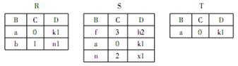

二级数据：真题模拟（二）2018

相关图书：《全国计算机等级考试二级教程——MySQL数据库程序设计》-高等教育出版社-教育部教育考试院-ISBN9787040648881

印次：2025年6月第 1 次

{/* truncate */}

<Workpaper>
<Workpapersettings />
  <Workitem xuanze>
    <Wenben>1. 叙述中正确的是</Wenben>
    <Xuanxiang>循环队列有队头和队尾两个指针，因此，循环队列是非线性结构</Xuanxiang>
    <Xuanxiang>在循环队列中，只需要队头指针就能反映队列中元素的动态变化情况</Xuanxiang>
    <Xuanxiang>在循环队列中，只需要队尾指针就能反映队列中元素的动态变化情况</Xuanxiang>
    <Xuanxiang ans>循环队列中元素的个数是由队头指针和队尾指针共同决定</Xuanxiang>
    <Jiexi>
    循环队列有队头和队尾两个指针，但是循环队列仍是线性结构的，所以 A 错误
    
    在循环队列中只需要队头指针与队尾两个指针来共同反映队列中元素的动态变化情况，所以 B 与 C 错误
    </Jiexi>
  </Workitem>
  <Workitem xuanze>
    <Wenben>2. 度为n的有序线性表中进行二分查找，最坏情况下需要比较的次数是</Wenben>
    <Xuanxiang>$O(n)$</Xuanxiang>
    <Xuanxiang>$O(n^{2})$</Xuanxiang>
    <Xuanxiang ans>$O(\log_{2}n)$</Xuanxiang>
    <Xuanxiang>$O(n\log_{2}n)$</Xuanxiang>
    <Jiexi>
    当有序线性表为顺序存储时才能用二分法查找。
    </Jiexi>
  </Workitem>
  <Workitem xuanze>
    <Wenben>3. 在软件开发中，需求分析阶段产生的主要文档是</Wenben>
    <Xuanxiang>可行性分析报告</Xuanxiang>
    <Xuanxiang ans>软件需求规格说明书</Xuanxiang>
    <Xuanxiang>概要设计说明书</Xuanxiang>
    <Xuanxiang>集成测试计划</Xuanxiang>
    <Jiexi>
    A 错误，可行性分析阶段产生可行性分析报告。
    
    C 错误，概要设计说明书是总体设计阶段产生的文档。
    
    D 错误，集成测试计划是在概要设计阶段编写的文档。
    
    B 正确，需求规格说明书是后续工作如设计、编码等需要的重要参考文档。
    </Jiexi>
  </Workitem>
  <Workitem xuanze>
    <Wenben>4. 算法的有穷性是指</Wenben>
    <Xuanxiang ans>算法程序的运行时间是有限的</Xuanxiang>
    <Xuanxiang>算法程序所处理的数据量是有限的</Xuanxiang>
    <Xuanxiang>算法程序的长度是有限的</Xuanxiang>
    <Xuanxiang>算法只能被有限的用户使用</Xuanxiang>
    <Jiexi>
    算法原则上能够精确地运行，而且人们用笔和纸做有限次运算后即可完成。有穷性是指算法程序的运行时间是有限的。
    </Jiexi>
  </Workitem>
  <Workitem xuanze>
    <Wenben>5. 对长度为 n 的线性表排序，在最坏情况下，比较次数不是 $n(n-1)/2$ 的排序方法是</Wenben>
    <Xuanxiang>快速排序</Xuanxiang>
    <Xuanxiang>冒泡排序</Xuanxiang>
    <Xuanxiang>直接插入排序</Xuanxiang>
    <Xuanxiang ans>堆排序</Xuanxiang>
    <Jiexi>
    除了堆排序算法的比较次数是 $O(n\log_{2}n)$，其他的都是 $n(n-1)/2$。
    </Jiexi>
  </Workitem>
  <Workitem xuanze>
    <Wenben>6. 下列关于栈的叙述正确的是</Wenben>
    <Xuanxiang>栈按“先进先出”组织数据</Xuanxiang>
    <Xuanxiang ans>栈按“先进后出”组织数据</Xuanxiang>
    <Xuanxiang>只能在栈底插入数据</Xuanxiang>
    <Xuanxiang>不能删除数据</Xuanxiang>
    <Jiexi>
    栈是按“先进后出”的原则组织数据的，数据的插入和删除都在栈顶进行操作。
    </Jiexi>
  </Workitem>
  <Workitem xuanze>
    <Wenben>7. 在数据库设计中，将 E-R 图转换成关系数据模型的过程属于</Wenben>
    <Xuanxiang>需求分析阶段</Xuanxiang>
    <Xuanxiang>概念设计阶段</Xuanxiang>
    <Xuanxiang ans>逻辑设计阶段</Xuanxiang>
    <Xuanxiang>物理设计阶段</Xuanxiang>
    <Jiexi>
    E-R 图转换成关系模型数据则是把图形分析出来的联系反映到数据库中，即设计出表，所以属于逻辑设计阶段。
    </Jiexi>
  </Workitem>
  <Workitem xuanze>
    <Wenben>
    8. 有三个关系 R、S 和 T 如下：由关系 R 和 S 通过运算得到关系 T，则所使用的运算为
    
    
    </Wenben>
    <Xuanxiang>笛卡尔积</Xuanxiang>
    <Xuanxiang>交</Xuanxiang>
    <Xuanxiang>并</Xuanxiang>
    <Xuanxiang ans>自然连接</Xuanxiang>
    <Jiexi>
    自然连接是一种特殊的等值连接，它要求两个关系中进行比较的分量必须是相同的属性组，并且在结果中把重复的属性列去掉，所以 B 错误。
    
    笛卡尔积是用 R 集合中元素为第一元素，S 集合中元素为第二元素构成的有序对，所以 C 错误。
    
    根据关系 T 可以很明显的看出是从关系 R 与关系 S 中取得相同的关系组所以取得是交运算。
    </Jiexi>
  </Workitem>
  <Workitem xuanze>
    <Wenben>9. 设有表示学生选课的三张表，学生S(学号，姓名，性别，年龄，身份证号)，课程C(课号，课名)，选课SC(学号，课号，成绩)，则表SC的关键字（键或码）为</Wenben>
    <Xuanxiang>课号，成绩</Xuanxiang>
    <Xuanxiang>学号，成绩</Xuanxiang>
    <Xuanxiang ans>学号，课号</Xuanxiang>
    <Xuanxiang>学号，姓名，成绩</Xuanxiang>
    <Jiexi>
    学号是学生表 S 的主键，课号是课程表 C 的主键，所以选课表 SC 的关键字就应该是与前两个表能够直接联系且能唯一定义的学号和课号。
    </Jiexi>
  </Workitem>
  <Workitem xuanze>
    <Wenben>10. 数据库管理系统提供的数据控制功能包括</Wenben>
    <Xuanxiang>数据的完整性</Xuanxiang>
    <Xuanxiang>恢复和并发控制</Xuanxiang>
    <Xuanxiang>数据的安全性</Xuanxiang>
    <Xuanxiang ans>以上所有各项</Xuanxiang>
    <Jiexi>
    数据库管理系统提供数据控制功能，即是数据的安全性、完整性和并发控制等对数据库运行进行有效地控制和管理，以确保数据正确有效。
    </Jiexi>
  </Workitem>
  <Workitem xuanze>
    <Wenben>11. 下列关于关系模型的叙述中，正确的是</Wenben>
    <Xuanxiang ans>关系模型用二维表表示实体及实体之间的联系</Xuanxiang>
    <Xuanxiang>外键的作用是定义表中两个属性之间的关系</Xuanxiang>
    <Xuanxiang>关系表中一列的数据类型可以不同</Xuanxiang>
    <Xuanxiang>主键是表中能够唯一标识元组的一个属性</Xuanxiang>
    <Jiexi>
    外键的作用建立和加强两个表数据之间的链接的一列或多列，保持数据一致性，完整性，所以 B 选项错误。
    
    关系表中一列的数据类型一定要相同，C 选项不正确。
    
    主键是表中能够唯一标识元组的一个属性或属性集，C 选项错误。
    </Jiexi>
  </Workitem>
  <Workitem xuanze>
    <Wenben>12. 数据库系统的三级模式结构是</Wenben>
    <Xuanxiang ans>模式，外模式，内模式</Xuanxiang>
    <Xuanxiang>外模式，子模式，内模式</Xuanxiang>
    <Xuanxiang>模式，逻辑模式，物理模式</Xuanxiang>
    <Xuanxiang>逻辑模式，物理模式，子模式</Xuanxiang>
  </Workitem>
  <Workitem xuanze>
    <Wenben>13. 1NF、2NF、3NF 之间的关系是</Wenben>
    <Xuanxiang>$1NF \subseteq 2NF \subseteq 3NF$</Xuanxiang>
    <Xuanxiang>$3NF \subseteq 2NF \subseteq 1NF$</Xuanxiang>
    <Xuanxiang>$1NF \subset 2NF \subset 3NF$</Xuanxiang>
    <Xuanxiang ans>$3NF \subset 2NF \subset 1NF$</Xuanxiang>
    <Jiexi>
    第一范式（1NF）就是无重复的列。
    
    第二范式（2NF）是在第一范式（1NF）的基础上建立起来的，即满足第二范式（2NF）必须先满足第一范式（1NF），第一范式不一定是第二范式。
    
    满足第三范式（3NF）必须先满足第二范式（2NF）。
    </Jiexi>
  </Workitem>
  <Workitem xuanze>
    <Wenben>14. 数据库系统三级模式之间的两级映像指的是</Wenben>
    <Xuanxiang>外模式/模式映象、外模式/内模式映象</Xuanxiang>
    <Xuanxiang ans>外模式/模式映象、模式/内模式映象</Xuanxiang>
    <Xuanxiang>外模式/内模式映象、模式/内模式映象</Xuanxiang>
    <Xuanxiang>子模式/模式映象、子模式/内模式映象</Xuanxiang>
    <Jiexi>
    模式是介于内模式和外模式之间的中间层次。三级模式之间的两级映像指外模式/模式映象、模式/内模式映象。
    </Jiexi>
  </Workitem>
  <Workitem xuanze>
    <Wenben>15. 下列关于数据的叙述中，错误的是</Wenben>
    <Xuanxiang ans>数据的种类分为文字、图形和图像三类</Xuanxiang>
    <Xuanxiang>数字只是最简单的一种数据</Xuanxiang>
    <Xuanxiang>数据是描述事物的符号记录</Xuanxiang>
    <Xuanxiang>数据是数据库中存储的基本对象</Xuanxiang>
    <Jiexi>
    数据是指存储在某种介质上能够识别的物理符号，是信息的载体，这些符号可以是、文字、符号、图像都是数据等。
    </Jiexi>
  </Workitem>
  <Workitem xuanze>
    <Wenben>16. 不属于 MySQL 逻辑运算符的是</Wenben>
    <Xuanxiang ans>|</Xuanxiang>
    <Xuanxiang>!</Xuanxiang>
    <Xuanxiang>||</Xuanxiang>
    <Xuanxiang>\&\&</Xuanxiang>
    <Jiexi>
    逻辑运算符包括逻辑非（not 或者!）， 逻辑与（and 或者 \&\&），逻辑或（or 或者||），逻辑异或（XOR）。
    </Jiexi>
  </Workitem>
  <Workitem xuanze>
    <Wenben>17. 设有部门和职工两个实体，每个职工只能属于一个部门，一个部门可以有多名职工，则部门与职工实体之间的联系类型是</Wenben>
    <Xuanxiang ans>1:n</Xuanxiang>
    <Xuanxiang>1:1</Xuanxiang>
    <Xuanxiang>m:n</Xuanxiang>
    <Xuanxiang>0:m</Xuanxiang>
  </Workitem>
  <Workitem xuanze>
    <Wenben>18. 下列关于 SQL 的叙述中，正确的是</Wenben>
    <Xuanxiang>SQL 是专供 MySQL 使用的结构化查询语言</Xuanxiang>
    <Xuanxiang>SQL 是一种过程化的语言</Xuanxiang>
    <Xuanxiang ans>SQL 是关系数据库的通用查询语言</Xuanxiang>
    <Xuanxiang>SQL 只能以交互方式对数据库进行操作</Xuanxiang>
    <Jiexi>
    SQL 是一个通用的、功能极强的关系数据库语言。
    
    SQL 是一个非过程化的语言，因为它一次处理一个记录，对数据提供自动导航。
    
    作为独立的语言，SQL 可以独立用于联机交互的使用方式，作为嵌入式语言，SQL 语句能够嵌入到高级语言（C，Java）程序中。
    </Jiexi>
  </Workitem>
  <Workitem xuanze>
    <Wenben>19. 下列关于空值的描述中，正确的是</Wenben>
    <Xuanxiang>空值等同于数值</Xuanxiang>
    <Xuanxiang>空值等同于空字符串</Xuanxiang>
    <Xuanxiang ans>空值表示无值</Xuanxiang>
    <Xuanxiang>任意两个空值均相同</Xuanxiang>
    <Jiexi>
    空值表示值未知。空值不同于空白或零值。没有两个相等的空值。
    </Jiexi>
  </Workitem>
  <Workitem xuanze>
    <Wenben>20. 在 MySQL 中，使用关键字 AUTO_INCREMENT 设置自增属性时，要求该属性列的数据类型是</Wenben>
    <Xuanxiang ans>INT</Xuanxiang>
    <Xuanxiang>DATETIME</Xuanxiang>
    <Xuanxiang>VARCHAR</Xuanxiang>
    <Xuanxiang>DOUBLE</Xuanxiang>
    <Jiexi>
    Auto_increment 会在新记录插入表中时生成一个唯一的数字，一个表只能有一个AUTO_INCREMENT属性，且该属性必须为主键的一部分。
    
    AUTO_INCREMENT 属性可以是任何整数类型（tinyint，smallint，int，bigint 等）。
    </Jiexi>
  </Workitem>
  <Workitem xuanze>
    <Wenben>21. 使用 SQL 语句查询学生信息表 tbl_student 中的所有数据，并按学生学号 stu_id 升序排列，正确的语句是</Wenben>
    <Xuanxiang ans>SELECT \* FROM tbl_student ORDER BY stu_id ASC;</Xuanxiang>
    <Xuanxiang>SELECT \* FROM tbl_student ORDER BY stu_id DESC;</Xuanxiang>
    <Xuanxiang>SELECT \* FROM tbl_student stu_id ORDER BY ASC;</Xuanxiang>
    <Xuanxiang>SELECT \* FROM tbl_student stu_id ORDER BY DESC;</Xuanxiang>
    <Jiexi>
    基本语法，ASC为升序，DESC为降序，ORDER BY后面必须跟上要排序的属性名，B为降序排列，C、D语法错误。
    </Jiexi>
  </Workitem>
  <Workitem xuanze>
    <Wenben>22. 在使用 INSERT 语句插入数据时，正确的使用形式不包括</Wenben>
    <Xuanxiang>INSERT…VALUES 语句</Xuanxiang>
    <Xuanxiang>INSERT…SELECT 语句</Xuanxiang>
    <Xuanxiang ans>INSERT… WHERE 语句</Xuanxiang>
    <Xuanxiang>INSERT…SET 语句</Xuanxiang>
    <Jiexi>
    insert…values 为一般常用的插入数据，A选项正确。
    
    Insert…select 常用于表复制式插入，B对。
    
    where 用于条件地从表中选取数据，不用于 insert 语句中。C错。
    
    Insert…set 适合插入单行，D对。
    </Jiexi>
  </Workitem>
  <Workitem xuanze>
    <Wenben>23. 对于 SQL 查询：SELECT \* FROM tbl_name WHERE id=(SELECT id FROM tbl_name)，假设该表中包含 id 字段，那么该语句正确执行的条件是</Wenben>
    <Xuanxiang>该表中必须有多条记录</Xuanxiang>
    <Xuanxiang>该表中必须只有一条记录</Xuanxiang>
    <Xuanxiang ans>该表中记录数必须小于等于一条</Xuanxiang>
    <Jiexi>
    当表中记录多于 1 条记录时，(SELECT id FROM tbl_name)返回的是一个结果集，把结果集赋给 id，显然执行语句失败，当记录小于等于 1 时，返回的是空或者是 id 值，可以作为条件查询。
    </Jiexi>
  </Workitem>
  <Workitem xuanze>
    <Wenben>24. SQL 中，不能创建索引的语句是</Wenben>
    <Xuanxiang>CREATE TABLE</Xuanxiang>
    <Xuanxiang>ALTER TABLE</Xuanxiang>
    <Xuanxiang>CREATE INDEX</Xuanxiang>
    <Xuanxiang ans>SHOW INDEX</Xuanxiang>
    <Jiexi>
    create table 创建表中可以建索引，A 对。
    
    Alter table 改变表的结构中可建索引，B 对。
    
    Create index 为创建索引语句,C 对。
    
    SHOW INDEX 用于返回表索引信息，不能用于创建索引。
    </Jiexi>
  </Workitem>
  <Workitem xuanze>
    <Wenben>
    25. 学生表 student 如下所示：

    ```
    学号  姓名   所在系编号   总学分
    021   林山      02        32
    026   张宏      01        26
    056   王林      02        22
    101   赵松      04        NULL
    ```

    下面 SQL 语句中返回值为 3 的是
    </Wenben>
    <Xuanxiang>SELECT COUNT(\*) FROM student;</Xuanxiang>
    <Xuanxiang>SELECT COUNT(所在系编号) FROM student;</Xuanxiang>
    <Xuanxiang>SELECT COUNT(\*) FROM student GROUP BY 学号;</Xuanxiang>
    <Xuanxiang ans>SELECT COUNT(总学分) FROM student;</Xuanxiang>
    <Jiexi>
    A 返回4
    
    B 返回4
    
    C 返回四个1
    </Jiexi>
  </Workitem>
  <Workitem xuanze>
    <Wenben>26. 下列关于表级约束和列级约束的描述中，不正确的是</Wenben>
    <Xuanxiang>列级约束针对某个特定的列，包含在列定义中</Xuanxiang>
    <Xuanxiang>表级约束与列定义相互独立，不包含在列定义中</Xuanxiang>
    <Xuanxiang ans>列级约束可能涉及到多个列，也可能仅涉及到一个列</Xuanxiang>
    <Xuanxiang>表级约束可能涉及到多个列，也可能仅涉及到一个</Xuanxiang>
    <Jiexi>
    列约束是对某一个特定列的约束，包含在列定义中，表约束与列定义相互独立，不包括在列定义中，通常用于对多个列一起进行约束。
    </Jiexi>
  </Workitem>
  <Workitem xuanze>
    <Wenben>27. 在 SELECT 语句中，指定需要查询的内容时，下列不可使用的是</Wenben>
    <Xuanxiang ans>百分号通配符</Xuanxiang>
    <Xuanxiang>列的别名</Xuanxiang>
    <Xuanxiang>聚合函数</Xuanxiang>
    <Xuanxiang>相应列参与计算的表达式</Xuanxiang>
    <Jiexi>
    百分号通配符用于不指定查询内容时，用于用于sql的模糊。B、C、D皆可根据查询需要使用。
    </Jiexi>
  </Workitem>
  <Workitem xuanze>
    <Wenben>28. MySQL 所支持的字符串匹配中，下列通常使用的通配符包括</Wenben>
    <Xuanxiang ans>\%</Xuanxiang>
    <Xuanxiang>\*</Xuanxiang>
    <Xuanxiang>?</Xuanxiang>
    <Xuanxiang>\$</Xuanxiang>
    <Jiexi>
    SQL 的模式匹配允许你使用 `_` 匹配任何单个字符，而 `%` 匹配任意数目字符。
    </Jiexi>
  </Workitem>
  <Workitem xuanze>
    <Wenben>29. 以下关于 PRIMARY KEY 和 UNIQUE 的描述中，错误的是</Wenben>
    <Xuanxiang ans>UNIQUE 约束只能定义在表的单个列上</Xuanxiang>
    <Xuanxiang>一个表上可以定义多个 UNIQUE，只能定义一个 PRIMARY KEY</Xuanxiang>
    <Xuanxiang>在空值列上允许定义 UNIQUE，不能定义 PRIMARY KEY</Xuanxiang>
    <Xuanxiang>PRIMARY KEY 和 UNIQUE 都可以约束属性值的唯一性</Xuanxiang>
    <Jiexi>
    UNIQUED 可空，可以在一个表里的一个或多个字段定义，A错。
    
    主关键字（primary key）是一种唯一关键字，表定义的一部分，一个表只能有一个，且不可为空，B、C对。
    
    UNIQUE 和 PRIMARY KEY 约束均为列或列集合提供了唯一性的保证。D对。
    </Jiexi>
  </Workitem>
  <Workitem xuanze>
    <Wenben>30. 在 MySQL 中创建视图时，WITH CHECK OPTION 子句的作用是</Wenben>
    <Xuanxiang ans>对于可更新视图，保证更新、插入或删除的行要满足视图定义中的谓词条件</Xuanxiang>
    <Xuanxiang>使用户能从多种角度看待同一数据</Xuanxiang>
    <Xuanxiang>防止通过视图插入或更新行</Xuanxiang>
    <Xuanxiang>去掉基本表的某些行和某些列</Xuanxiang>
    <Jiexi>
    WITH CHECK OPTION 表示对视图进行 UPDATE INSERT DELETE 操作时，要保证操作的数据满足视图定义的谓词条件，也就是视图子查询中的 WHERE 子句的条件。即数据的改变，不能超出 WITH CHECK OPTION 所约束的范围。B、C、D错。
    </Jiexi>
  </Workitem>
  <Workitem xuanze>
    <Wenben>31. SQL 中，激活触发器的命令包括</Wenben>
    <Xuanxiang>CREATE、DROP、INSERT</Xuanxiang>
    <Xuanxiang>SELECT、CREATE、UPDATE</Xuanxiang>
    <Xuanxiang ans>INSERT、DELETE、UPDATE</Xuanxiang>
    <Xuanxiang>CREATE、DELETE、UPDATE</Xuanxiang>
    <Jiexi>
    对一个表进行操作（insert，delete， update）时才会激活触发器执行，即对表进入基本数据的操作时会激活触发器。 
    
    Creat、drop 用来创建、删除用户、表等操作并不能激活触发器，A、B、D 错。
    </Jiexi>
  </Workitem>
  <Workitem xuanze>
    <Wenben>32. 触发器内容的语句是</Wenben>
    <Xuanxiang ans>SHOW TRIGGERS;</Xuanxiang>
    <Xuanxiang>SELECT \* FROM information_schema;</Xuanxiang>
    <Xuanxiang>SELECT \* FROM TRIGGERS;</Xuanxiang>
    <Xuanxiang>SELECT \* FROM TRIGGER;</Xuanxiang>
    <Jiexi>
    查看触发器内容用 SHOW TRIGGERS。B 为查询表中所有数据的语句。Select \* from 后面跟表，不能用此语句查触发器，C、D错。
    </Jiexi>
  </Workitem>
  <Workitem xuanze>
    <Wenben>33. 使用 PHP 进行 MySQL 编程时，不能读取结果集中记录的函数是</Wenben>
    <Xuanxiang>mysql_fetch_array( )</Xuanxiang>
    <Xuanxiang>mysql_fetch_row( )</Xuanxiang>
    <Xuanxiang>mysql_fetch_assoc( )</Xuanxiang>
    <Xuanxiang ans>mysql_affected_rows( )</Xuanxiang>
    <Jiexi>
    mysql_fetch_array( ) 函数从结果集中取得一行作为关联数组，或数字数组。
    
    mysql_fetch_row( ) 函数从结果集中取得一行作为数字数组。
    
    mysql_fetch_assoc( )函数从结果集中取得一行作为关联数组。
    
    mysql_affected_rows( ) 函数返回前一次 MySQL 操作所影响的记录行数。
    </Jiexi>
  </Workitem>
  <Workitem xuanze>
    <Wenben>34. 在 MySQL 中，存储过程可以使用</Wenben>
    <Xuanxiang>局部变量</Xuanxiang>
    <Xuanxiang>用户变量</Xuanxiang>
    <Xuanxiang>系统变量</Xuanxiang>
    <Xuanxiang ans>以上皆可以使用</Xuanxiang>
  </Workitem>
  <Workitem xuanze>
    <Wenben>35. 以下所列出的工作中，不属于数据库运行维护的工作是</Wenben>
    <Xuanxiang ans>系统实现</Xuanxiang>
    <Xuanxiang>备份数据库</Xuanxiang>
    <Xuanxiang>性能检测</Xuanxiang>
    <Xuanxiang>安全性保护</Xuanxiang>
    <Jiexi>
    系统实现在数据库维护之前。备份数据库、性能检测、安全性保护是正常的数据库运行维护。
    </Jiexi>
  </Workitem>
  <Workitem xuanze>
    <Wenben>36. 函数 mysql_connect( ) 和 mysql_pconnect( ) 都能建立与数据库服务器的连接，下列关于两者的描述正确的是</Wenben>
    <Xuanxiang ans>mysql_connect( ) 建立非持久连接，可以使用 mysql_close( ) 关闭连接</Xuanxiang>
    <Xuanxiang>mysql_pconnect( ) 建立非持久连接，可以使用 mysql_close( ) 关闭连接</Xuanxiang>
    <Xuanxiang>mysql_pconnect( ) 建立持久连接，可以使用 mysql_close( ) 关闭连</Xuanxiang>
    <Xuanxiang>mysql_connect( ) 建立非持久连接，不可以使用 mysql_close( ) 关闭连接</Xuanxiang>
    <Jiexi>
    mysql_connect( ) 函数打开非持久的MySQL连接，可调用关闭
    
    mysql_pconnect( ) 函数打开一个到 MySQL 服务器的持久连接, 关闭不了。
    </Jiexi>
  </Workitem>
  <Workitem xuanze>
    <Wenben>37. 下列关于用户及权限的叙述中，错误的是</Wenben>
    <Xuanxiang ans>删除用户时，系统同时删除该用户创建的表</Xuanxiang>
    <Xuanxiang>root 用户拥有操作和管理 MySQL 的所有权限</Xuanxiang>
    <Xuanxiang>系统允许给用户授予与 root 相同的权限</Xuanxiang>
    <Xuanxiang>新建用户必须经授权才能访问数据库</Xuanxiang>
    <Jiexi>
    删除用户时，系统不会删除该用户创建的表。root 是系统中的超级管理员用户帐户，拥有所有的权限，B 对。
    
    新建用户时，并不任何权限，只有授权后才能访问操作数据库，D 对。
    
    系统允许授予用户和 root 权限，C 对。
    </Jiexi>
  </Workitem>
  <Workitem xuanze>
    <Wenben>38. 把对 Student 表和 Course 表的全部操作权授予用户 User1 和 User2 的语句是</Wenben>
    <Xuanxiang ans>GRANT All ON Student, Course TO User1, User2;</Xuanxiang>
    <Xuanxiang>GRANT Student, Course ON All TO User1, User2;</Xuanxiang>
    <Xuanxiang>GRANT All TO Student, Course ON User1, User2;</Xuanxiang>
    <Xuanxiang>GRANT All TO User1, User2 ON Student, Course;</Xuanxiang>
    <Jiexi>
    表操作权授权给用户的语法: `GRANT <权限>[,<权限>]... [ON <对象类型> <对象名>] TO <用户>[,<用户>]... [WITH GRANT OPTION];` On 后面跟表名 student、course，To 后面跟用户 User1 , User2。
    </Jiexi>
  </Workitem>
  <Workitem xuanze>
    <Wenben>39. 下列工具中，非图形化用户界面的 MySQL 管理工具是</Wenben>
    <Xuanxiang ans>mysql</Xuanxiang>
    <Xuanxiang>phpAdmin</Xuanxiang>
    <Xuanxiang>Navicat</Xuanxiang>
    <Xuanxiang>MySQL Workbench</Xuanxiang>
    <Jiexi>
    mysql 是安装数据库系统后系统自带的非图形化的管理工具。
    
    phpAdmin 是在 php 环境下管理 mysql 数据库的工具，是一款功能非常强大的 mysql 页面管理工具。
    
    avicat 是一套快速、可靠并价格相宜的数据库图形化管理工具，专为简化数据库的管理及降低系统管理成本而设。
    
    workbench 是操作数据库的界面环境。
    </Jiexi>
  </Workitem>
</Workpaper>