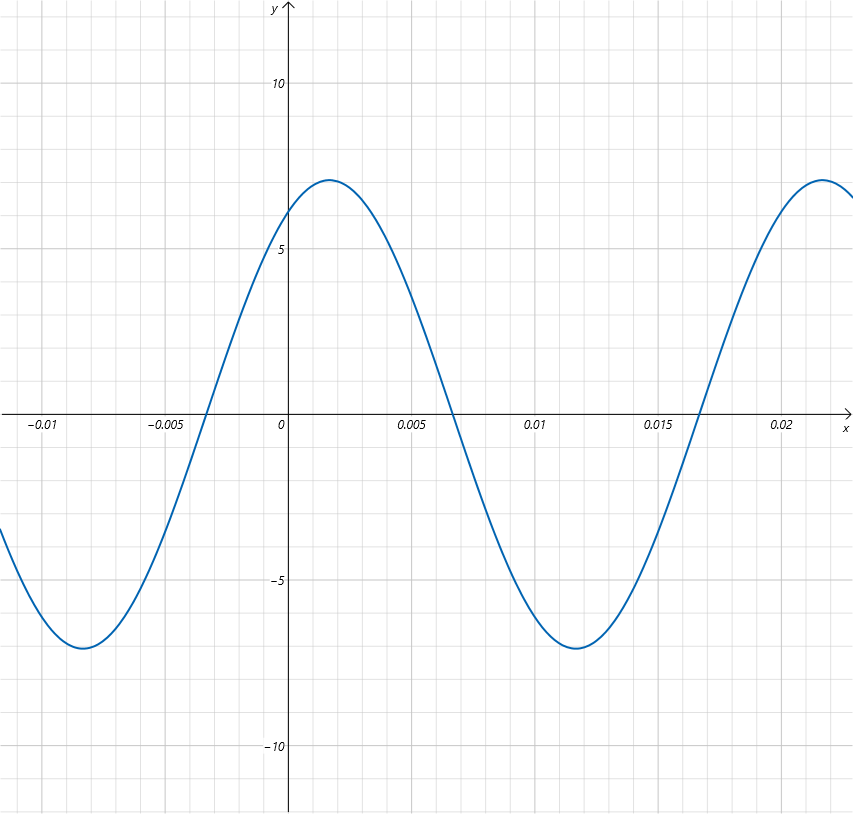

电工与电子技术第10次作业。

相关图书：《电工与电子技术》-北京师范大学出版社-刘陆平、肖祖铭-ISBN9787303280391

印次：2023年7月第 1 次

{/* truncate */}

## 计算

<Workpaper>
<Workpapersettings />
  <Workitem tiankong>
    <Wenben>
      01. 有一闭合回路如图所示，各支路的元件是任意的，已知 $U_{AB}=5V$，$U_{BC}=-4V$，$U_{DA}=-3V$。试求 $U_{CD}$ 和 $U_{CA}$（课本P28，1-7）

      
    </Wenben>
    <Ansinput katex />
    <Jiexi>
      如图，$U_{AB}=5V$，$U_{BC}=-4V$，$U_{DA}=-3V$

      

      对回路 ABCD 列 KVL 方程

      $U_{AB}+U_{BC}+U_{CD}+U_{DA}=0$

      $\therefore U_{CD}=-U_{AB}-U_{BC}-U_{OA}=-5V-(-4V)-(-3V)=2V$

      对假想回路 ABC 列 KCL 方程

      $U_{AB}+U_{BC}+U_{CA}=0$

      $\therefore U_{CA}=-U_{AB}-U_{BC}=-5V-(-4V)=-1V$
    </Jiexi>
  </Workitem>
  <Workitem tiankong>
    <Wenben>2. 一正弦交流电的频率是 50Hz，有效值是 5A，初相位是 $\frac{\pi}{3}$，写出它的瞬时值表达式，并画出它的波形图。</Wenben>
    <Ansinput katex />
    <Jiexi> 
      $f=50Hz\Rightarrow \omega=2\pi f=314rad/s$

      $I=5A$，$\varphi=\frac{\pi}{3}$，$I_m=\sqrt2 \cdot I=5\sqrt2A$

      $\therefore i(t)=i_m\sin(\omega t+\varphi)A=5\sqrt2\sin(314t+\frac{\pi}{3})A$

      波形图如下：

      
    </Jiexi>
  </Workitem>
  <Workitem tiankong>
    <Wenben>3. 用相量图法计算 $i=[3\sqrt2 \sin(100\pi t+30^{\circ})+4\sqrt2 \sin(100\pi t-60^{\circ})]A$</Wenben>
    <Ansinput katex />
    <Jiexi>
      

      $i_1=3\sqrt2 \sin(100\pi t+30^{\circ})A \Rightarrow \dot{I}_{m1}=3\sqrt2 \angle 30^{\circ}A \Rightarrow \dot{I}_{1}=3\angle30^{\circ}A$

      $i_2=4\sqrt2 \sin(100\pi t-60^{\circ})A \Rightarrow \dot{I}_{m2}=4\sqrt2 \angle -60^{\circ}A \Rightarrow \dot{I}_{2}=4\angle-60^{\circ}A$

      $\dot{I}=\dot{I}_{1}+\dot{I}_{2}$

      $I=\sqrt{3^2+4^2}=5$

      $\varphi=\arctan\frac{3}{4}\approx36.9^{\circ}$

      $\therefore \varphi_i=60^{\circ}-\varphi=23.1^{\circ}$

      即电流 $i$ 的初相位为 $-23.1^{\circ}$

      $\therefore \dot{I}=5\angle-23.1^{\circ}A$

      $\therefore i(t)=5\sqrt2 \sin(100\pi t-23.1^{\circ})A$
    </Jiexi>
  </Workitem>
</Workpaper>