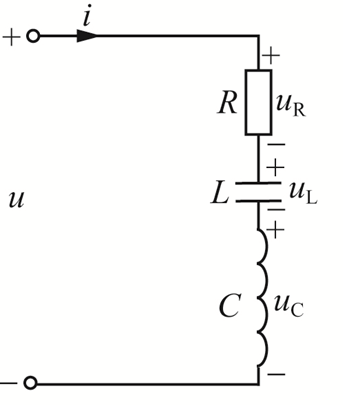
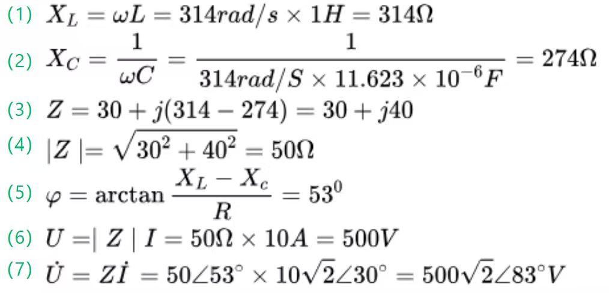

电工与电子技术第12次作业。

相关图书：《电工与电子技术》-北京师范大学出版社-刘陆平、肖祖铭-ISBN9787303280391

印次：2023年7月第 1 次

{/* truncate */}

## 计算

<Workpaper>
<Workpapersettings />
  <Workitem tiankong>
    <Wenben>
        有一 RLC 串联的正弦交流电路，R=30Ω，电感 L=1H，C=11.623μF，电流为 $i(t)=10\sqrt2 \sin(314t+30^{\circ})A$，电路如下图所示

        

        （1）求感抗

        （2）求容抗

        （3）求阻抗

        （4）求阻抗的模

        （5）求阻抗角

        （6）求电压的有效值

        （7）求电压的幅值相量
    </Wenben>
    <Ansinput katex />
    <Jiexi></Jiexi>
  </Workitem>
</Workpaper>