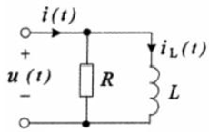
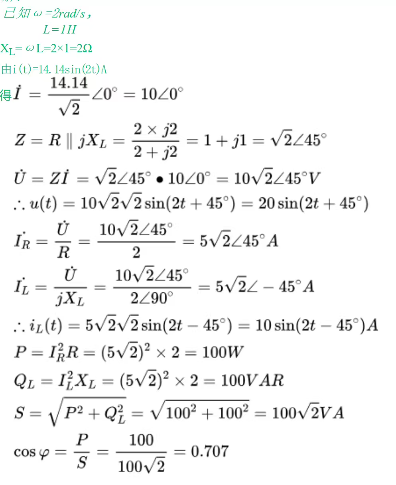

电工与电子技术第13次作业。

相关图书：《电工与电子技术》-北京师范大学出版社-刘陆平、肖祖铭-ISBN9787303280391

印次：2023年7月第 1 次

{/* truncate */}

## 简答

<Workpaper>
<Workpapersettings />
  <Workitem tiankong>
    <Wenben>1. 试述提高功率因数的意义和方法？</Wenben>
    <Ansinput katex />
    <Jiexi>
        提高线路的功率因数，一方面可提高供电设备的利用率，另一方面可以减少线路上的功率损耗。

        其方法是在感性设备两端并联适当的电容。电容 C 容量的计算公式是：

        $C=\frac{P}{\omega U^2}(\tan\varphi_{L}-\tan\varphi)$
    </Jiexi>
  </Workitem>
</Workpaper>

## 计算

<Workpaper>
<Workpapersettings />
  <Workitem tiankong>
    <Wenben>
        2. 在如图所示电路中，已知 R=2Ω，L=1H，$i(t)=14.14\sin(2t)A$，求 u(t) 、i(t)、电路的有功功率和无功功率及功率因数。

        
    </Wenben>
    <Ansinput katex />
    <Jiexi></Jiexi>
  </Workitem>
</Workpaper>