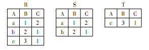
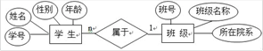
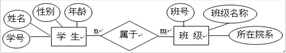
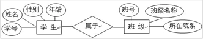

二级数据：真题模拟（一）

相关图书：《全国计算机等级考试二级教程——MySQL数据库程序设计》-高等教育出版社-教育部教育考试院-ISBN9787040648881

印次：2025年6月第 1 次

{/* truncate */}

<Workpaper>
<Workpapersettings />
  <Workitem xuanze>
    <Wenben>1. 下列关于栈叙述中正确的是</Wenben>
    <Xuanxiang ans>栈顶元素最先能被删除</Xuanxiang>
    <Xuanxiang>栈底元素最后才能被删除</Xuanxiang>
    <Xuanxiang>栈底元素永远不能被删除</Xuanxiang>
    <Xuanxiang>栈底元素是最先被删除</Xuanxiang>
    <Jiexi>
    栈是先进后出的数据结构，所以栈顶元素是最后入栈最先被删除。栈底元素最先进却最后被删除
    </Jiexi>
  </Workitem>
  <Workitem xuanze>
    <Wenben>2. 下列叙述中正确的是</Wenben>
    <Xuanxiang>在栈中，栈中元素随栈底指针与站定指针的变化而动态变化</Xuanxiang>
    <Xuanxiang>在栈中，栈顶指针不变，栈中元素随栈底指针的变化而动态变化</Xuanxiang>
    <Xuanxiang ans>在栈中，栈底指针不变，栈中元素随栈顶指针的变化而变化</Xuanxiang>
    <Xuanxiang>以上说法均不对</Xuanxiang>
    <Jiexi>
    栈是先进后出的数据结构，在整个过程中，栈底指针不变，入栈与出栈操作均由栈顶指针的变化来操作
    </Jiexi>
  </Workitem>
  <Workitem xuanze>
    <Wenben>3. 某二叉树共有 7 个节点，其中叶子节点有 1 个，则该二叉树的深度为（假设根结点在第 1 层）</Wenben>
    <Xuanxiang>3</Xuanxiang>
    <Xuanxiang>4</Xuanxiang>
    <Xuanxiang>6</Xuanxiang>
    <Xuanxiang ans>7</Xuanxiang>
    <Jiexi>
    根据二叉树的性质 3：在任意一棵二叉树中，度为 0 的叶子节点总比度为 2 的节点多一个，所以本题中度为 2 的节点为 1-1=0 个，所以知道本题目中的二叉树的每个节点都有一个分支，所以 7 个节点共 7 层，即度为 7.
    </Jiexi>
  </Workitem>
  <Workitem xuanze>
    <Wenben>4. 软件功能可以分为应用软件、系统软件和支撑软件（或工具软件）。下面属于应用软件的是</Wenben>
    <Xuanxiang ans>学生成绩管理系统</Xuanxiang>
    <Xuanxiang>C 语言编译程序</Xuanxiang>
    <Xuanxiang>UNIX 操作系统</Xuanxiang>
    <Xuanxiang>数据库管理系统</Xuanxiang>
    <Jiexi>
    软件按功能分为：应用软件、系统软件、支撑软件。操作系统、编译程序、汇编程序、网络软件、数据库管理系统都属于系统软件。所以 B、C、D 都是系统软件，只有 A 是应用软件。
    </Jiexi>
  </Workitem>
  <Workitem xuanze>
    <Wenben>5. 结构化程序所要求的基本结构不包括</Wenben>
    <Xuanxiang>顺序结构</Xuanxiang>
    <Xuanxiang ans>GOTO 跳转</Xuanxiang>
    <Xuanxiang>选择（分支）结构</Xuanxiang>
    <Xuanxiang>重复（循环）结构</Xuanxiang>
    <Jiexi>
    1966 年 Boehm 和 Jacopini 证明了程序设计语言仅仅使用顺序、选择和重复三种基本控制结构就足以表达出各种其他形式结构的程序设计方法。
    </Jiexi>
  </Workitem>
  <Workitem xuanze>
    <Wenben>6. 下面描述中错误的是</Wenben>
    <Xuanxiang ans>系统总体结构图支持软件系统的详细设计</Xuanxiang>
    <Xuanxiang>软件设计是将软件需求转换为软件表示的过程</Xuanxiang>
    <Xuanxiang>数据结构与数据库设计是软件设计的任务之一</Xuanxiang>
    <Xuanxiang>PAD 图是软件详细设计的表示工具</Xuanxiang>
    <Jiexi>
    详细设计的任务是为软件结构图中而非总体结构图中的每一个模块确定实现算法和局部数据结构，用某种选定的表达工具表示算法和数据结构的细节
    </Jiexi>
  </Workitem>
  <Workitem xuanze>
    <Wenben>7. 负责数据库中查询操作的数据库语言是</Wenben>
    <Xuanxiang>数据定义语言</Xuanxiang>
    <Xuanxiang>数据管理语言</Xuanxiang>
    <Xuanxiang ans>数据操纵语言</Xuanxiang>
    <Xuanxiang>数据控制语言</Xuanxiang>
    <Jiexi>
    数据定义语言：负责数据的模式定义与数据的物理存取构建
    
    数据操纵语言：负责数据的操纵，包括查询及增、删、改等操作
    
    数据控制语言：负责数据完整性、安全性的定义与检查以及并发控制、故障恢复等功能
    </Jiexi>
  </Workitem>
  <Workitem xuanze>
    <Wenben>8. 一个教师可讲授多门课程，一门课程可由多个教师讲授。则实体教师和课程间的联系是</Wenben>
    <Xuanxiang>1∶1联系</Xuanxiang>
    <Xuanxiang>1∶m联系</Xuanxiang>
    <Xuanxiang>m∶1联系</Xuanxiang>
    <Xuanxiang ans>m∶n联系</Xuanxiang>
    <Jiexi>
    因为一个教师可讲授多门课程，而一门课程又能由多个老师讲授，所以它们之间是多对多的关系，可以表示为 m∶n。
    </Jiexi>
  </Workitem>
  <Workitem xuanze>
    <Wenben>
    9. 有三个关系 R、S 和 T 如下，则由关系 R 和 S 得到关系 T 的操作是

    
    </Wenben>
    <Xuanxiang>自然连接</Xuanxiang>
    <Xuanxiang>并</Xuanxiang>
    <Xuanxiang>交</Xuanxiang>
    <Xuanxiang ans>差</Xuanxiang>
    <Jiexi>
    关系 T 中的元组是关系 R 中有而关系 S 中没有的元组的集合，即从关系 R 中除去与关系 S 中相同元组后得到的关系 T。所以做的是差的运算。
    </Jiexi>
  </Workitem>
  <Workitem xuanze>
    <Wenben>10. 定义无符号整数类为 UInt，下面可以作为类 UInt 实例化值的是</Wenben>
    <Xuanxiang>-369</Xuanxiang>
    <Xuanxiang ans>369</Xuanxiang>
    <Xuanxiang>0.369</Xuanxiang>
    <Xuanxiang>整数集合 {1,2,3,4,5}</Xuanxiang>
    <Jiexi>
    只有 B 选项 369 可以用无符号整数来表示和存储。A 选项 -369 有负号，选项 C 0.369 是小数都不能用无符号整数类存储。选项 D 是一个整数集合得用数组来存储。
    </Jiexi>
  </Workitem>
  <Workitem xuanze>
    <Wenben>11. 模式/内模式映像保证数据库系统中的数据能够具有较高的</Wenben>
    <Xuanxiang>逻辑独立性</Xuanxiang>
    <Xuanxiang ans>物理独立性</Xuanxiang>
    <Xuanxiang>共享性</Xuanxiang>
    <Xuanxiang>结构化</Xuanxiang>
    <Jiexi>
    模式/内模式映像定义了数据库的逻辑结构与物理存储之间的对应关系，该映像关系通常被保存在数据的系统表中。当数据库的物理存储变了，如选择了另一个存储位置，只需要对模式/内模式映像做相应的调整，就可以保持模式不变，从而也不必改变应用程度。因此，保证了数据与程序的物理独立性
    </Jiexi>
  </Workitem>
  <Workitem xuanze>
    <Wenben>12. 常见的数据库系统运行与应用结构包括</Wenben>
    <Xuanxiang ans>C/S 和 B/S</Xuanxiang>
    <Xuanxiang>B2B 和 B2C</Xuanxiang>
    <Xuanxiang>C/S 和 P2P</Xuanxiang>
    <Xuanxiang>B/S</Xuanxiang>
    <Jiexi>
    常见的数据库系统运行与应用结构包括 C/S 和 B/s
    </Jiexi>
  </Workitem>
  <Workitem xuanze>
    <Wenben>13. 数据库、数据库管理系统和数据库系统三者之间的关系是</Wenben>
    <Xuanxiang>数据库包括数据库管理系统和数据库系统</Xuanxiang>
    <Xuanxiang ans>数据库系统包括数据库和数据库管理系统</Xuanxiang>
    <Xuanxiang>数据库管理系统包括数据库和数据库系统</Xuanxiang>
    <Xuanxiang>不能相互包括</Xuanxiang>
  </Workitem>
  <Workitem xuanze>
    <Wenben>14. 定义数据库全局逻辑结构与存储结构之间对应关系的是</Wenben>
    <Xuanxiang ans>模式/内模式映象</Xuanxiang>
    <Xuanxiang>外模式/内模式映象</Xuanxiang>
    <Xuanxiang>外模式/模式映象</Xuanxiang>
    <Xuanxiang>以上都不正确</Xuanxiang>
    <Jiexi>
    模式也称为逻辑模式，是数据库中全体数据的逻辑结构和特征的描述，内模式也称为存储模式，描述了数据的存储结构
    </Jiexi>
  </Workitem>
  <Workitem xuanze>
    <Wenben>15. 下列不属于数据库管理系统主要功能的是</Wenben>
    <Xuanxiang ans>数据计算功能</Xuanxiang>
    <Xuanxiang>数据定义功能</Xuanxiang>
    <Xuanxiang>数据操作功能</Xuanxiang>
    <Xuanxiang>数据库的维护功能</Xuanxiang>
    <Jiexi>
    数据库管理系统主要功能是数据定义功能、数据存取功能、数据库运行管理功能、数据库的建立和维护功能。数据库管理系统不包括数据计算功能
    </Jiexi>
  </Workitem>
  <Workitem xuanze>
    <Wenben>16. 以下关于数据库设计的叙述中，错误的是</Wenben>
    <Xuanxiang ans>设计数据库就是编写数据库的程序</Xuanxiang>
    <Xuanxiang>数据库逻辑设计的结果不是唯一的</Xuanxiang>
    <Xuanxiang>数据库物理设计与具体的设备和数据库管理系统相关</Xuanxiang>
    <Xuanxiang>数据库设计时，要对关系模型进行优化</Xuanxiang>
    <Jiexi>
    设计是指对于一个给定的应用环境，构造最优的数据库，建立系统，使之能够有效地，满足各种用户的应用(信息要求和处理要求)
    
    数据库逻辑设计决定了数据库及其应用的整体性能，调优位置，在规范化设计等方面不同导致结果相应不同
    
    设计数据库的，根据数据库的来选定 RDBMS（如 Oracle、Sybase 等），并设计和实施数据库的、存取方式等，与设备和数据库系统关联性很大
    
    对关系模型进行优化就是对数据库逻辑结构及至整个数据库系统的优化
    </Jiexi>
  </Workitem>
  <Workitem xuanze>
    <Wenben>
    17. 下列 E-R 图中，能够正确表达学生与班级两个实体之间关系的是
    
    *提示：点击选项序号 ABCD 来选择*
    </Wenben>
    <Xuanxiang ans></Xuanxiang>
    <Xuanxiang></Xuanxiang>
    <Xuanxiang></Xuanxiang>
    <Xuanxiang></Xuanxiang>
  </Workitem>
  <Workitem xuanze>
    <Wenben>18. 数据独立性是指</Wenben>
    <Xuanxiang ans>物理独立性和逻辑独立性</Xuanxiang>
    <Xuanxiang>应用独立性和数据独立性</Xuanxiang>
    <Xuanxiang>用户独立性和应用独立性</Xuanxiang>
    <Xuanxiang>逻辑独立性和用户独立性</Xuanxiang>
  </Workitem>
  <Workitem xuanze>
    <Wenben>19. MySQL 中用来创建数据库对象的命令是</Wenben>
    <Xuanxiang ans>CREATE</Xuanxiang>
    <Xuanxiang>ALTER</Xuanxiang>
    <Xuanxiang>DROP</Xuanxiang>
    <Xuanxiang>GRANT</Xuanxiang>
    <Jiexi>
    ALTER TABLE 语句用于在已有的表中添加、修改或删除列。DROP 语句， 删除索引、表和数据库等。grant 在安全系统中创建项目
    </Jiexi>
  </Workitem>
  <Workitem xuanze>
    <Wenben>20. 在 MySQL 中，指定一个已存在的数据库作为当前工作数据库的命令是</Wenben>
    <Xuanxiang ans>USE</Xuanxiang>
    <Xuanxiang>USING</Xuanxiang>
    <Xuanxiang>CREATE</Xuanxiang>
    <Xuanxiang>SELECT</Xuanxiang>
    <Jiexi>
    SQL 不用USING。CREATE 创建数据库。SELECT 查询命令
    </Jiexi>
  </Workitem>
  <Workitem xuanze>
    <Wenben>21. 在使用 ALTER TABLE 修改表结构时，关于 CHANGE 和 MODIFY 两子句的描述中，不正确的是</Wenben>
    <Xuanxiang>CHANGE 后面需要写两次列名，而 MODIFY 后面只写一次</Xuanxiang>
    <Xuanxiang>两种方式都可用于修改某个列的数据类型</Xuanxiang>
    <Xuanxiang>都可以使用 FIRST 或 AFTER 来修改列的排列顺序</Xuanxiang>
    <Xuanxiang ans>MODIFY 可用于修改某个列的名称</Xuanxiang>
    <Jiexi>
    change 可以修改列的名称和数据类型，MODIFY可以修改某些列的
    
    修改列类型分别为 `ALTER TABLE t1 CHANGE b b BIGINT NOT NULL; ALTER TABLE t1 MODIFY b BIGINT NOT NULL`
    
    两者排序均可以用 first 或 after
    </Jiexi>
  </Workitem>
  <Workitem xuanze>
    <Wenben>22. 使用 MySQL 时，可以在 MySQL 客户端中执行 SQL 语句，但下面无法用于执行 SQL 语句的客户端工具是</Wenben>
    <Xuanxiang>mysql命令行</Xuanxiang>
    <Xuanxiang>phpMyAdmin</Xuanxiang>
    <Xuanxiang ans>mysqld</Xuanxiang>
    <Xuanxiang>Navicat工具</Xuanxiang>
    <Jiexi>
    phpMyAdmin 和 Navicat 为数据库管理工具，mysql 命令行皆可执行 SQL 语句
    </Jiexi>
  </Workitem>
  <Workitem xuanze>
    <Wenben>23. 在 MySQL 数据库中，以下不会受字符集设置影响的数据类型有</Wenben>
    <Xuanxiang>CHAR</Xuanxiang>
    <Xuanxiang ans>INT</Xuanxiang>
    <Xuanxiang>VARCHAR</Xuanxiang>
    <Xuanxiang>TEXT</Xuanxiang>
    <Jiexi>
    不同的字符集如 UTF8、GBK、DEC8 等，汉字明显会受到影响，可能显示乱码，但整形却都能显示正常
    </Jiexi>
  </Workitem>
  <Workitem xuanze>
    <Wenben>24. DELETE 语句中不能使用的子句是</Wenben>
    <Xuanxiang ans>GROUP BY</Xuanxiang>
    <Xuanxiang>WHERE</Xuanxiang>
    <Xuanxiang>ORDER BY</Xuanxiang>
    <Xuanxiang>LIMIT</Xuanxiang>
    <Jiexi>
    GROUP BY 语句用于结合合计函数，根据一个或多个列对结果集进行分组，不能用于 DELETE 语句中
    
    Where 用于选择删除的条件选取
    
    order by、limit 可以组合在一起实现删除排序后的前几个
    </Jiexi>
  </Workitem>
  <Workitem xuanze>
    <Wenben>
    25. 执行如下创建表的 SQL 语句时出现错误。需要修改的命令行是

    ```sql showLineNumbers
    CREATE TABLE tb_test(
        Sno CHAR(10) AUTO_INCREMENT,
        Sname VARCHAR(20) NOT NULL,
        Sex CHAR(1),
        Scome DATE,
        PRIMARY KEY(Sno)
        ENGINE=Inno(        )
    ```
    </Wenben>
    <Xuanxiang ans>第2行和第7行</Xuanxiang>
    <Xuanxiang>第4行和第7行</Xuanxiang>
    <Xuanxiang>第2行、第4行和第6行</Xuanxiang>
    <Xuanxiang>第4行、第5行和第7行</Xuanxiang>
    <Jiexi>
    AUTO_INCREMENT 对应的是整数，不能用char，应为`int(10) AUTO_INCREMENT;`最后一个语法错误，删除即可
    </Jiexi>
  </Workitem>
  <Workitem xuanze>
    <Wenben>
    26. 部门表 tb_dept 的定义如下

    ```sql showLineNumbers
    CREATE TABLE tb_dept(
        deptno CHAR(2)  primary key,
        dname CHAR(20)  Not null,
        manager CHAR(12),
        telephone CHAR(15)
    );
    ```
    下列说法中正确的是
    </Wenben>
    <Xuanxiang ans>deptno 的取值不允许为空，不允许重复</Xuanxiang>
    <Xuanxiang>dname 的取值允许为空，不允许重复</Xuanxiang>
    <Xuanxiang>deptno 的取值允许为空，不允许重复</Xuanxiang>
    <Xuanxiang>dname 的取值不允许为空，不允许重复</Xuanxiang>
    <Jiexi>
    deptno 是主键，不可为空，不能重复
    </Jiexi>
  </Workitem>
  <Workitem xuanze>
    <Wenben>27. 于 MySQL 中 UNION 操作符的使用，描述错误的是</Wenben>
    <Xuanxiang ans>UNION 用于合并两个或多个 SELECT 语句的结果集，但不会消去任何重复行</Xuanxiang>
    <Xuanxiang>UNION 内部的 SELECT 语句必须拥有相同数量的列，列也必须拥有相似的数据类型</Xuanxiang>
    <Xuanxiang>每条 SELECT 语句中的列的顺序必须相同</Xuanxiang>
    <Xuanxiang>UNION 结果集中的列名总是等于 UNION 中第一个 SELECT 语句中的列名</Xuanxiang>
    <Jiexi>
    union 合并结果集时，会消去重复行
    </Jiexi>
  </Workitem>
  <Workitem xuanze>
    <Wenben>28. 下列不能使用 ALTER 命令进行修改的数据库对象是</Wenben>
    <Xuanxiang ans>触发器</Xuanxiang>
    <Xuanxiang>事件</Xuanxiang>
    <Xuanxiang>存储过程</Xuanxiang>
    <Xuanxiang>存储函数</Xuanxiang>
    <Jiexi>
    若要修改触发器，将其重新创建并重新部署，将原始版本替换为修改后的版本。事件、存储过程、存储函数都能通过 alter 修改
    </Jiexi>
  </Workitem>
  <Workitem xuanze>
    <Wenben>29. 在 MySQL 中创建事件时，指定的执行时机包括</Wenben>
    <Xuanxiang>单次计划任务</Xuanxiang>
    <Xuanxiang>重复计划任务</Xuanxiang>
    <Xuanxiang ans>单次计划任务或重复计划任务</Xuanxiang>
    <Xuanxiang>按照优先级调度执行</Xuanxiang>
    <Jiexi>
    事件的执行时机分一次性和重复，是根据创建时设置来执行
    </Jiexi>
  </Workitem>
  <Workitem xuanze>
    <Wenben>30. 在存储过程体的 WHILE 语句中，要实现退出当前循环，且重新开始一个新的循环，通常可使用的语句是</Wenben>
    <Xuanxiang ans>ITERATE 语句</Xuanxiang>
    <Xuanxiang>LEAVE 语句</Xuanxiang>
    <Xuanxiang>JUMP 语句</Xuanxiang>
    <Xuanxiang>GOTO 语句</Xuanxiang>
    <Jiexi>
    leave 主要用在跳出循环，相当于程序中的`break;`关键字提供了相当于 continue 的功能 iterate
    </Jiexi>
  </Workitem>
  <Workitem xuanze>
    <Wenben>31. 在使用游标时，实际完成数据读取任务的语句</Wenben>
    <Xuanxiang ans>FETCH...INTO...</Xuanxiang>
    <Xuanxiang>SELECT</Xuanxiang>
    <Xuanxiang>DECLARE...CURSOR</Xuanxiang>
    <Xuanxiang>SET</Xuanxiang>
    <Jiexi>
    FETCH...INTO...select 是查询语句关键字。Declare...cursor 是声明游标。Set 是设置变量
    </Jiexi>
  </Workitem>
  <Workitem xuanze>
    <Wenben>32. 在 MySQL 的实用工具中，用于对数据库进行备份的程序是</Wenben>
    <Xuanxiang>mysqladmin</Xuanxiang>
    <Xuanxiang ans>mysqldump</Xuanxiang>
    <Xuanxiang>mysqlcheck</Xuanxiang>
    <Xuanxiang>mysqlimport</Xuanxiang>
    <Jiexi>
    mysqldump 是备份整个数据库的命令。用于执行管理性操作，不具有备份的功能。mysqlcheck 客户端可以检查和修复 MyISAM 表，它还可以优化和分析表。mysqlimport 位于 mysql/bin 目录中，是 mysql 的一个载入（或者说导入）数据的一个非常有效的工具，不是备份数据
    </Jiexi>
  </Workitem>
  <Workitem xuanze>
    <Wenben>33. 以下关于 MySQL 二进制日志文件的叙述中，正确的是</Wenben>
    <Xuanxiang ans>二进制日志文件用于数据库恢复</Xuanxiang>
    <Xuanxiang>二进制日志文件记录了对数据表的全部操作</Xuanxiang>
    <Xuanxiang>二进制日志功能默认是开启的</Xuanxiang>
    <Xuanxiang>启用二进制日志文件，对系统运行性能没有影响</Xuanxiang>
    <Jiexi>
    MySQL 的二进制日志可以说或是 MySQL 最重要的日志了，它记录了所有的 DDL 和 DML （除了数据查询语句）语句，以事件形式记录，还包含语句所执行的消耗的时间，MySQL 的二进制日志是失误安全型的。MySQL 的二进制日志的作用是显而易见的，可以方便的备份这些日志以便做数据恢复
    </Jiexi>
  </Workitem>
  <Workitem xuanze>
    <Wenben>34. 使用 `SELECT * INTO OUTFILE` 语句备份数据库时，导出的是</Wenben>
    <Xuanxiang ans>数据表中的数据</Xuanxiang>
    <Xuanxiang>数据表的结构</Xuanxiang>
    <Xuanxiang>数据表的结构和数据</Xuanxiang>
    <Xuanxiang>整个数据库</Xuanxiang>
    <Jiexi>
    `SELECT INTO…OUTFILE` 语句把表数据导出到一个文本文件中
    </Jiexi>
  </Workitem>
  <Workitem xuanze>
    <Wenben>35. MySQL服务器所使用的配置文件是</Wenben>
    <Xuanxiang ans>my.ini</Xuanxiang>
    <Xuanxiang>my-small.ini</Xuanxiang>
    <Xuanxiang>my-medium.ini</Xuanxiang>
    <Xuanxiang>my-large.ini</Xuanxiang>
    <Jiexi>
    MySQL 服务器正确安装配置完毕之后，会在 MySQL 的主目录下生成一个 MySQL 启动时自动加载的选项文件就是 my.ini
    </Jiexi>
  </Workitem>
  <Workitem xuanze>
    <Wenben>36. 在使用 SHOW GRANTS 命令显示用户权限时结果为 USAGE，该用户拥有的权限为</Wenben>
    <Xuanxiang>当前数据库上的使用权限</Xuanxiang>
    <Xuanxiang>所有数据库对象上的所有权限</Xuanxiang>
    <Xuanxiang ans>无权限</Xuanxiang>
    <Xuanxiang>所有数据库对象上的使用权限</Xuanxiang>
    <Jiexi>
    USAGE “无权限”的同义词。显示权限时有USAGE，表示当前用户无任何权限
    </Jiexi>
  </Workitem>
  <Workitem xuanze>
    <Wenben>37. 在安装和配置 MySQL 服务器的向导中，可选择决策支持型（OLAP）或联机事务处理（OLTP）型，这两种情况的缺省并发用户数分别为</Wenben>
    <Xuanxiang>OLAP 500，OLTP 20</Xuanxiang>
    <Xuanxiang ans>OLAP 20，OLTP 500</Xuanxiang>
    <Xuanxiang>OLAP 20，OLTP 20</Xuanxiang>
    <Xuanxiang>OLAP 500，OLTP 500</Xuanxiang>
  </Workitem>
</Workpaper>